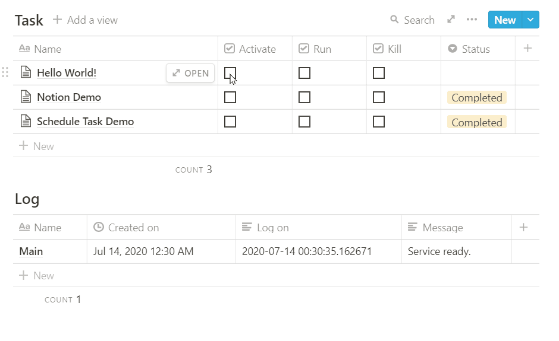
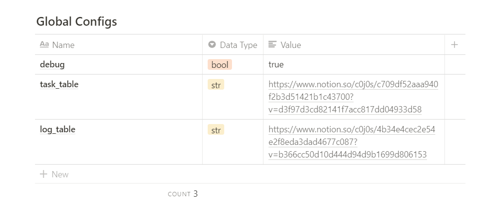
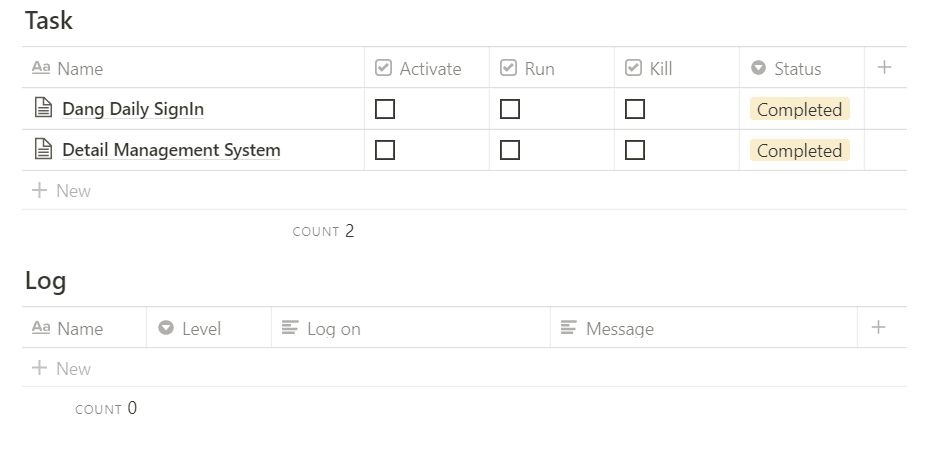
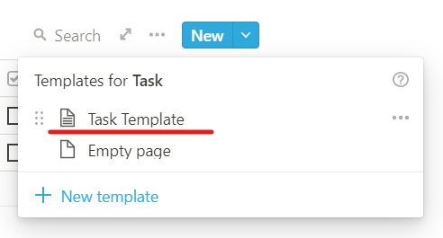
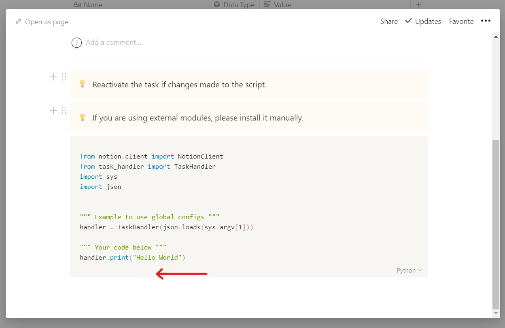
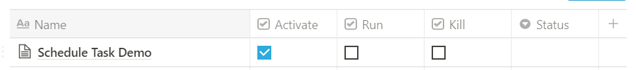
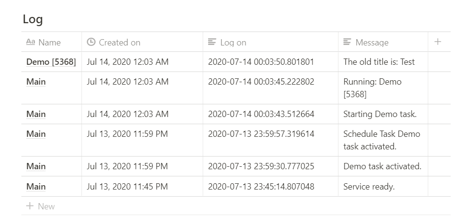

# A Customisable Notion Task Handler
After tinkering with the unofficial notion python api for a while, I find myself constantly switching between notion and scripting environment a lot, oftentimes for the sole purpose of testing a few new lines of codes added to the entire script.

Furthermore, deployment of the service scripts to the server can be a pain, I would have to manually log onto my server, upload the file and run the script, etc. As such, I wonder if there’s a way for me to do all these unit testing, deployment in notion itself? And so this project was born.

This project allows you to create, run, and deploy python code from notion page itself by simply running a single python script in your machine.



### **What can you do with it?**

- Run any python scripts.
- Run schedule tasks for automation purposes.

> Check out the demos in the [template](https://www.notion.so/c0j0s/Customisable-Notion-Task-Handler-7cb192b26a79460fb69ae64af2189f20) page.

### **What you need?**

- A computer/server capable of running python scripts.
- Internet access
- Python ≥ 3.6 (Only tested version)

> Based on [unofficial notion python api](https://github.com/jamalex/notion-py) by jamalex. Refer to his github for API references.

# Setting up

1. Clone this project.

2. Duplicate the control page from this [Template](https://www.notion.so/c0j0s/Customisable-Notion-Task-Handler-7cb192b26a79460fb69ae64af2189f20).

3. Update local and remote config with your own.

- *Local configs*
    1. Rename **config.json.example** to **config.json**.
    2. update notion `token` and your own `global config table` link.

        ```json
        {
        	"token":"<Replace with your token>",
        	"global_configs":"<Replace with your table link>"
        }
        ```

- *Remote global configs*

    Update your **task_table** and **log_table** link.

    

    1. Start Task Handler Script
    2. Install required packages

        ```bash
        pip3 install notion
        ```

    3. Run script

        ```bash
        python3 customisable_notion_task_handler.py
        ```

        You should see the output in `console` and `notion log table`.

        ```bash
        (env) root: python3 customisable_notion_task_handler.py
        [2020-07-13 23:45:10.932766]: Service ready.
        ```

        

# Add your own custom python scripts

1. Create a new item using the template provided.

    

2. Add you python code here.

    

    > If you are using external modules, please install it manually.

3. Accessing global configs and outputting to notion log table.

    ```python
    # The handler object stores the configs
    handler = TaskHandler(sys.argv[1])

    # To access configs using table name
    x = handler.configs["debug"]

    # Use handler print() to write to notion log table
    handler.print("Hello World")
    ```
# Running Scripts

1. Before you run the script, check the activate box so that the python code is written to the server.

    

    The status will change to `Activated`.
    > The script is not updated in realtime, therefore reactivation is needed to reflect your updated scripts.

2. Check the `Run` checkbox to run the script. Output will be written in log table if `debug` option is set to `True`.

    

3. If required, check `Kill` checkbox to terminate the script.
    > `[Main]` is the parent process of all other scripts. It can neither be activated nor ran, It only can be terminated.  
    > The script will terminate all running child processes when kill signal is issued `[Main]`.
