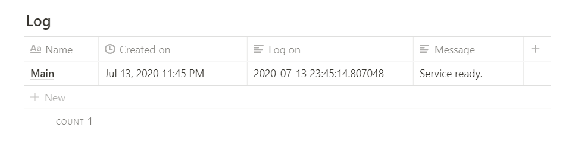

# Customisable Notion Task Handler
This script allow you to run python code in notion page itself.


### What can you do with it?
- Run any python scripts.
- Run schedule tasks for automation purposes.
> Check out the demos in the [Template](https://www.notion.so/c0j0s/Customisable-Notion-Task-Handler-7cb192b26a79460fb69ae64af2189f20) page.

### What you need?
- A computer/server capable of running python scripts.
- Internet access

# Setting up
1. Clone this project.

2. Duplicate the control page from this 
[Template](https://www.notion.so/c0j0s/Customisable-Notion-Task-Handler-7cb192b26a79460fb69ae64af2189f20).

3. Update local and remote config with your own.  
    _Local configs_
   1. Rename `config.json.example` to `config.json`.
   2. update notion `token` and your own `global config table` link.  
   ```json
    {
        "token":"<Replace with your token>",  
        "global_configs":"<Replace with your table link>"  
    }
   ```

   _Remote global configs_  
   Update your `task_table` and `log_table` link.  
   

4. Start Task Handler Script  
    1. Install required packages  
        ```bash
        pip3 install notion
        ```

    2. Run script
        ```bash
        python3 customisable_notion_task_handler.py
        ```

        You should see the output in `console` and `notion log table`.  
    
        ```bash
        (env) root: python3 customisable_notion_task_handler.py  

        [2020-07-13 23:45:10.932766]: Service ready.
        ```
        


# Add your own custom python scripts
1. Create a new item using the template provided.


2. Add you python code here
    
    > If you are using external modules, please install it manually.

3. Accessing global configs and outputting to notion log table.
    ```py
    # The handler object stores the configs
    handler = TaskHandler(json.loads(sys.argv[1]))

    # To access configs using table name
    x = handler.configs["debug"]

    # Use handler print() to write to notion log table
    handler.print("Hello World")

    ```

# Running Scripts
1. Before you run the script, check the activate box so that the python code is written to the server.

The status will change to `Activated`.

2. Check the `Run` checkbox to run the script. Output will be written in log table if `debug` option is set to `True`.


3. If required, check `Kill` checkbox to terminate the script.